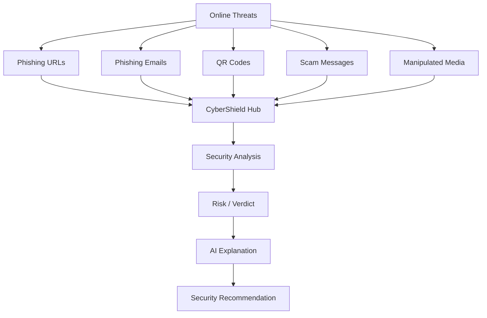
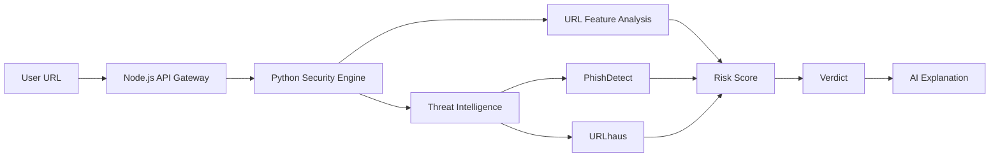
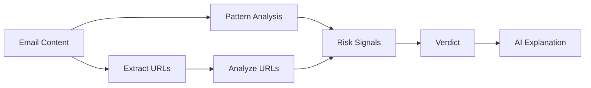
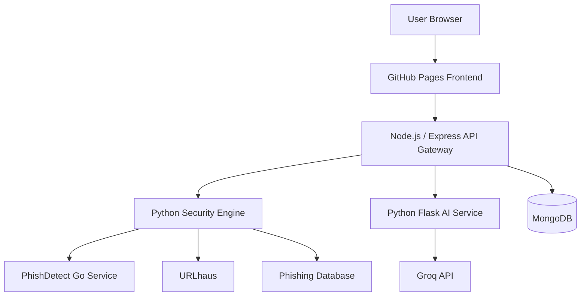
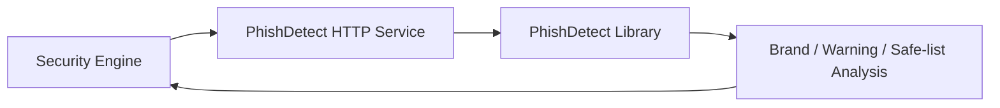

# 🛡️ CyberShield Hub

### AI-Powered Cybersecurity Toolkit

CyberShield Hub is a full-stack cybersecurity platform designed to help users identify, analyze, and understand common online threats through a collection of security tools and an integrated AI Cyber Assistant.

The project combines **HTML/CSS/JavaScript, Node.js/Express, Python/Flask, MongoDB, heuristic URL analysis, threat intelligence, QR-code analysis, phishing-email analysis, media analysis, and Groq-powered AI** into one unified cybersecurity platform.

---

## 🔗 Links

| | |
|---|---|
| 🖥️ Live Site | https://satyamtiwari23.github.io/CyberSheild_Hub/index.html |
| 💻 GitHub Repository | https://github.com/Satyamtiwari23/CyberSheild_Hub |
| 🔐 Node.js Backend | https://cybersheild-hub.onrender.com |
| 🛡️ Security Engine | https://cybershield-security-engine.onrender.com |
| 🔎 PhishDetect Service | https://cybershield-phishdetect.onrender.com |
| 🤖 AI Service | https://cybershield-ai-rdm7.onrender.com |
| 💼 LinkedIn | https://www.linkedin.com/in/satyam-tiwari-8s5a4t3y8a7m4104/ |
| ✉️ Email | sttiwari9211@gmail.com |

---

## 📌 Why CyberShield Hub

Modern cyber threats can arrive through suspicious websites, phishing emails, malicious QR codes, scam messages, or manipulated media. CyberShield Hub brings several of these analysis workflows together in one platform.

Instead of only showing a raw risk score, the platform combines **security analysis + detected signals + AI explanations + safety recommendations** to help users understand why an input may be suspicious.



---

# 🚀 Features

## 🔗 1. Phishing Website / URL Detector

The phishing-link module analyzes suspicious URLs using a combination of heuristic indicators and external threat-intelligence checks.

### Current capabilities

- URL risk scoring
- Risk-level classification
- HTTPS detection
- IP-address-based URL detection
- `@` symbol detection
- Suspicious-word detection
- Subdomain analysis
- URL-shortener detection
- Phishing database checks
- URLhaus threat-intelligence checks
- PhishDetect analysis
- Detailed detected signals
- AI-powered explanation
- Warning before opening suspicious websites
- Report-suspicious-website option

### Analysis flow



> The URL scanner is heuristic and threat-intelligence based. It should not be treated as a guaranteed malware or phishing verdict.

---

## 📱 2. QR Code Analyzer

The QR scanner can analyze QR codes from both the **camera and uploaded images**.

### QR detection

The project uses:

- **ZXing Browser** for camera-based QR scanning
- **jsQR** for image/gallery decoding
- ZXing fallback for difficult uploaded images
- Image resizing and preprocessing for better QR recognition

### Supported QR payload types

- 🌐 Website URLs
- 💳 UPI / payment QR codes
- 📧 Email / `mailto:`
- 📞 Phone / `tel:`
- 💬 SMS
- 🟢 WhatsApp links and groups
- 📶 Wi-Fi configuration
- 📍 Location
- 📝 Plain text

UPI payloads are parsed to identify information such as:

- UPI ID
- Payee name
- Amount
- Currency
- Transaction ID
- Transaction reference
- Payment note

Payment-app actions are shown only after the user continues from the QR result, helping prevent accidental or premature payment actions.

---

## 📧 3. Phishing Email Analyzer

The email analyzer allows users to submit suspicious email content and inspect potential phishing indicators.

### Capabilities

- Suspicious-pattern detection
- Risk scoring
- Threat verdict
- Suspicious URL extraction
- URL analysis before opening
- AI explanation
- Security recommendations



Suspicious URLs are surfaced for analysis instead of being automatically opened.

---

## 🎭 4. Deepfake / Media Detector

The project includes a media-analysis module for image, video, and media-URL inputs.

The current implementation is intended as a **prototype / experimentation layer**, with browser-based media and face analysis.

Potential future improvements include:

- Frame-by-frame video analysis
- Facial landmark analysis
- Temporal consistency analysis
- Compression-artifact analysis
- TensorFlow.js models
- CNN / transformer-based detection models
- Trained deepfake classification models

> The current implementation should not be represented as a production-grade deepfake detection system without a properly trained detection model.

---

## 💬 5. Scam Message Analyzer

The platform also includes a scam-message analysis workflow for identifying suspicious characteristics in potentially fraudulent messages.

The analysis can be combined with the platform's security heuristics and AI explanation workflow to help users understand possible risks.

---

# 🤖 CyberShield AI Assistant

CyberShield includes a separate **Python/Flask AI service** powered by the **Groq API**.

The current AI service uses:

```text
openai/gpt-oss-120b
```

The AI Assistant can:

- Explain phishing results
- Explain suspicious URLs
- Explain QR-code risks
- Explain phishing emails
- Provide cybersecurity recommendations
- Answer general cybersecurity questions
- Answer educational programming/security questions

---

## 🧠 Context-Aware AI

The frontend sends the active page/module along with the AI prompt.

Example:

```javascript
{
    topic: "...",
    page: "phishing"
}
```

### Supported page contexts

| Page | Purpose |
|---|---|
| `assistant` | General educational AI assistance |
| `phishing` | Phishing URL/security analysis |
| `qr` | QR-code security analysis |
| `email` | Phishing-email analysis |
| `deepfake` | Media/deepfake analysis |

This allows the AI service to understand which CyberShield module is requesting the explanation.

---

# 🏗️ System Architecture

CyberShield Hub now uses a service-based architecture.



### Service responsibilities

| Service | Responsibility | Port |
|---|---|---:|
| Frontend | UI and browser-side tools | 5500 locally |
| Node.js / Express | API gateway, authentication, database operations | 5001 |
| Security Engine | URL analysis and threat intelligence | 5002 |
| PhishDetect | Phishing URL detection | 5003 |
| AI Service | AI explanations and assistant | 5004 |
| MongoDB | Application data | Cloud / local |

---

# 🔌 API Architecture

## Node.js / Express API Gateway

The Node.js backend acts as the central API gateway between the frontend and the backend services.

### URL analysis

```http
POST /api/url/analyze
```

Example request:

```json
{
  "url": "https://example.com"
}
```

The Node backend forwards the request to the Security Engine.

```text
Frontend
   ↓
POST /api/url/analyze
   ↓
Node.js / Express
   ↓
POST /analyze-url
   ↓
Python Security Engine
```

### AI explanation

```http
POST /api/ai/explain
```

Example:

```json
{
  "topic": "Explain why this URL may be suspicious.",
  "page": "phishing"
}
```

The request is forwarded to the AI service:

```text
Frontend
   ↓
POST /api/ai/explain
   ↓
Node.js / Express
   ↓
POST /generate
   ↓
Python Flask AI Service
   ↓
Groq API
```

---

# 🛡️ Security Engine

The Security Engine is a Python/Flask service responsible for URL analysis.

### Main endpoints

```http
GET /health
POST /analyze-url
```

### URL analysis components

```text
URL
 ↓
URL Feature Extraction
 ↓
Heuristic Scoring
 ↓
Threat Intelligence
 ├── PhishDetect
 ├── URLhaus
 └── Phishing Database
 ↓
Signals + Score
 ↓
Risk Verdict
```

The engine returns information such as:

```json
{
  "features": {},
  "score": 0,
  "signals": [],
  "threat_intelligence": {},
  "verdict": "LOW_RISK"
}
```

---

# 🔎 PhishDetect Service

CyberShield uses the open-source **PhishDetect** Go library through a separate Go microservice.

The service exposes:

```http
GET /health
POST /analyze
```

The Python Security Engine communicates with it internally.



The service is isolated from the main Python application so the phishing-detection dependency can run independently.

---

# 🌐 Local vs Production Configuration

CyberShield is designed to work in both local development and production without maintaining separate frontend codebases.

The frontend selects the API endpoint based on the hostname.

### Local

```text
Frontend
   ↓
http://127.0.0.1:5001
   ↓
Local Node.js Backend
   ↓
Local Security Engine / AI Service
```

### Production

```text
GitHub Pages
   ↓
https://cybersheild-hub.onrender.com
   ↓
Render Security Engine / AI Service
```

This approach allows the same frontend files to be used locally and on the deployed website.

---

# 🌍 Production Services

The project currently uses Render for backend services.

```text
GitHub Pages
    │
    ▼
Node.js API Gateway
https://cybersheild-hub.onrender.com
    │
    ├──► Security Engine
    │      https://cybershield-security-engine.onrender.com
    │
    │      └──► PhishDetect
    │             https://cybershield-phishdetect.onrender.com
    │
    └──► AI Service
           https://cybershield-ai-rdm7.onrender.com
```

> Free-tier cloud services may sleep when inactive and can require some time to wake up.

---

# 💻 Technology Stack

### Frontend

- HTML5
- CSS3
- JavaScript ES6+
- DOM manipulation
- Fetch API
- LocalStorage
- Responsive UI

### Backend

- Node.js
- Express.js
- Axios
- REST APIs
- JWT authentication
- bcrypt
- Google/Gmail OAuth integration

### Security Engine

- Python
- Flask
- Flask-CORS
- URL parsing
- Heuristic risk scoring
- Threat intelligence APIs

### Phishing Detection

- Go
- PhishDetect

### Database

- MongoDB
- Mongoose

### AI

- Groq API
- `openai/gpt-oss-120b`
- Python
- Flask
- Context-aware prompting

### QR

- ZXing Browser
- jsQR
- Browser camera APIs
- Image preprocessing

### Media

- face-api.js
- Browser-based media analysis experimentation

### Development Tools

- VS Code
- Git
- GitHub
- npm
- Python virtual environments
- MongoDB Compass / Atlas
- Chrome DevTools
- Postman
- Render

---

# 📁 Project Structure

```text
CyberSheild_Hub/
│
├── AI-chatbot/
│   ├── app.py
│   ├── .env
│   ├── requirements.txt
│   ├── templates/
│   │   └── index.html
│   ├── static/
│   └── venv/
│
├── backend/
│   ├── .env
│   ├── package.json
│   ├── package-lock.json
│   └── server.js
│
├── frontend/
│   ├── index.html
│   ├── login.html
│   ├── phishing-link.html
│   ├── phishing-email.html
│   ├── qr-scanner.html
│   ├── deepfake-detector*.html
│   ├── scam-message.html
│   ├── chrome-extension.html
│   └── ...
│
├── security-engine/
│   ├── app.py
│   ├── .env
│   ├── requirements.txt
│   ├── .gitignore
│   │
│   ├── risk/
│   │   └── fusion.py
│   │
│   ├── url/
│   │   ├── analyzer.py
│   │   ├── features.py
│   │   └── threat_intel.py
│   │
│   └── phishdetect-service/
│       ├── go.mod
│       ├── go.sum
│       ├── main.go
│       └── Dockerfile
│
├── .gitignore
└── README.md
```

---

# 🔐 Environment Variables

## Node.js Backend

Typical backend configuration includes service URLs and application secrets.

```env
SECURITY_ENGINE_URL=http://127.0.0.1:5002
AI_SERVICE_URL=http://127.0.0.1:5004
```

Production values point to the corresponding Render services.

---

## AI Service

```env
GROQ_API_KEY=your_groq_api_key
```

---

## Security Engine

```env
PHISHDETECT_URL=http://127.0.0.1:5003
URLHAUS_AUTH_KEY=your_urlhaus_key
```

Production deployment uses the deployed PhishDetect service URL.

> Never commit API keys or secrets to GitHub.

---

# ⚙️ Installation & Local Development

## 1. Clone the repository

```bash
git clone https://github.com/Satyamtiwari23/CyberSheild_Hub.git
cd CyberSheild_Hub
```

---

## 2. Install Node.js Backend

From:

```text
CyberSheild_Hub/backend/
```

Run:

```bash
npm install
node server.js
```

The backend runs on:

```text
http://127.0.0.1:5001
```

---

## 3. Start the Security Engine

From:

```text
CyberSheild_Hub/security-engine/
```

Create/activate the Python environment:

```bash
python3 -m venv venv
source venv/bin/activate
python3 -m pip install -r requirements.txt
python3 app.py
```

The Security Engine runs on:

```text
http://127.0.0.1:5002
```

---

## 4. Start PhishDetect

From:

```text
CyberSheild_Hub/security-engine/phishdetect-service/
```

Run:

```bash
go run main.go
```

The service runs on:

```text
http://127.0.0.1:5003
```

The Security Engine should point to:

```env
PHISHDETECT_URL=http://127.0.0.1:5003
```

---

## 5. Start the AI Service

From:

```text
CyberSheild_Hub/AI-chatbot/
```

Run:

```bash
python3 -m venv venv
source venv/bin/activate
python3 -m pip install -r requirements.txt
python3 app.py
```

The AI service runs on:

```text
http://127.0.0.1:5004
```

---

## 6. Run the Frontend

Serve the `frontend/` directory using a local development server such as VS Code Live Server.

Example:

```text
http://127.0.0.1:5500
```

The frontend automatically uses local backend URLs during local development and production Render URLs when opened from the deployed GitHub Pages site.

---

# 🧪 Testing

## 🔗 URL Scanner

### Safe example

```text
https://example.com
```

### Suspicious example

```text
http://192.168.1.10/login
```

Check:

- Risk score
- Verdict
- Detected signals
- Threat intelligence
- AI explanation

---

## 📱 QR Scanner

Test:

```text
upi://...
https://example.com
tel:+911234567890
mailto:test@example.com
WIFI:T:WPA;S:MyWiFi;P:password;;
```

Also test:

- Camera scanning
- Gallery upload
- Large QR images
- UPI/payment QR codes
- Website QR codes
- WhatsApp QR links

---

## 📧 Email Analyzer

Use an example phishing email containing:

- Urgent language
- Suspicious sender information
- Fake account warnings
- Suspicious URLs

Verify:

- Extracted URLs
- Risk indicators
- Verdict
- AI explanation

---

## 🎭 Media Analyzer

Test:

- Normal images
- Face images
- Videos
- AI-generated images/media

Advanced deepfake evaluation requires a trained detection model.

---

# 🔒 Security Considerations

- API keys are kept server-side
- Secrets are stored in `.env`
- `.env` files are excluded through `.gitignore`
- User input is validated before processing
- Suspicious URLs are not automatically opened
- QR payment actions require explicit user interaction
- HTTPS is used for deployed services
- Authentication and authorization should be strengthened before handling sensitive production data

---

# ⚠️ Limitations

### URL Detection

Heuristic and threat-intelligence based detection cannot guarantee that a website is completely safe or malicious.

### QR Detection

The scanner identifies QR payloads and can analyze suspicious characteristics, but decoding a QR code does not guarantee that its destination is safe.

### Email Detection

The email analyzer uses implemented detection logic and should not be considered a replacement for enterprise email-security systems.

### Deepfake Detection

The current media analysis is a prototype and does not represent a production-grade deepfake classifier without a properly trained ML/DL model.

### AI

AI-generated explanations can contain mistakes. Security decisions should always be independently verified.

### Cloud Deployment

Free cloud services may experience cold starts, sleeping services, or temporary availability issues.

---

# 🎯 Future Improvements

## 🛡️ Security

- VirusTotal integration
- Google Safe Browsing
- Domain age / WHOIS analysis
- DNS analysis
- SSL certificate analysis
- IP reputation
- Malware sandboxing
- More threat-intelligence providers

## 📱 QR Security

- Advanced UPI fraud indicators
- Redirect-chain analysis
- Malicious-domain detection
- QR image manipulation detection
- Payment risk scoring

## 📧 Email Security

- SPF analysis
- DKIM verification
- DMARC analysis
- Header analysis
- Sender reputation
- Attachment analysis
- Social-engineering detection

## 🎭 Deepfake Detection

- TensorFlow.js
- Frame-by-frame video analysis
- Facial landmark analysis
- Temporal-consistency analysis
- CNN / transformer models
- Trained deepfake datasets

## 🤖 AI

- Conversation history
- Authentication-aware AI
- Threat-specific AI agents
- Automated security reports
- Multi-model support
- Streaming responses
- Security-report export

---

# 📊 Project Highlights

- Full-stack web development
- REST API architecture
- Node.js / Express
- Python / Flask
- Go microservice
- MongoDB / Mongoose
- Groq AI integration
- Context-aware AI prompting
- URL threat analysis
- Phishing detection
- QR-code analysis
- Email security analysis
- Media-analysis experimentation
- Authentication
- Cloud deployment
- Git / GitHub
- Responsive frontend design

---

# 📌 Project Status

### 🟢 Implemented

- Frontend cybersecurity dashboard
- Phishing URL scanner
- URL heuristic analysis
- URL threat-intelligence integration
- PhishDetect microservice
- QR camera scanner
- QR gallery/image scanner
- QR payload classification
- UPI QR analysis
- Phishing email analyzer
- Scam-message analyzer
- AI Cyber Assistant
- Groq API integration
- Python Flask AI service
- Node.js / Express API gateway
- MongoDB integration
- Authentication system
- Local/production API switching
- Render deployment configuration

### 🟡 In Progress / Advanced

- Production-grade deepfake detection
- Advanced threat intelligence
- More robust cloud-service reliability
- Advanced UPI fraud detection
- Enterprise-grade email security analysis

---

# 👨‍💻 Author

**Satyam Tiwari**

B.Tech Information Technology Student  
Aspiring Full-Stack & AI Developer

### Areas of Interest

- Full-Stack Development
- Artificial Intelligence
- Cybersecurity
- Machine Learning
- Backend Development
- Cloud Deployment

---

# ⭐ Disclaimer

CyberShield Hub is an **educational cybersecurity project**.

Detection results are generated using implemented heuristics, security-analysis logic, external threat-intelligence services, and AI-generated explanations. No result should be treated as a guaranteed security verdict.

Always verify suspicious URLs, emails, QR codes, messages, and files using trusted security tools before taking action.
