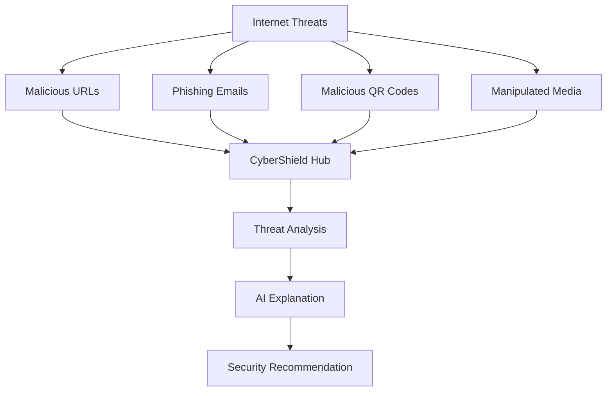
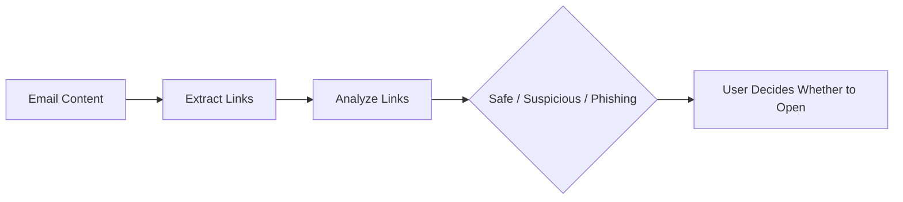
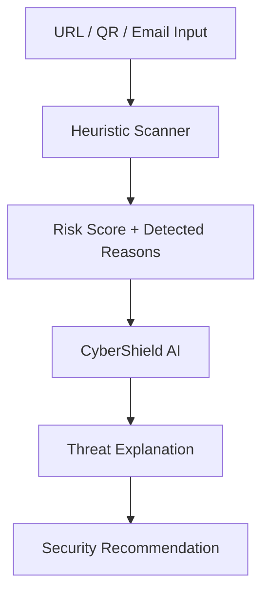
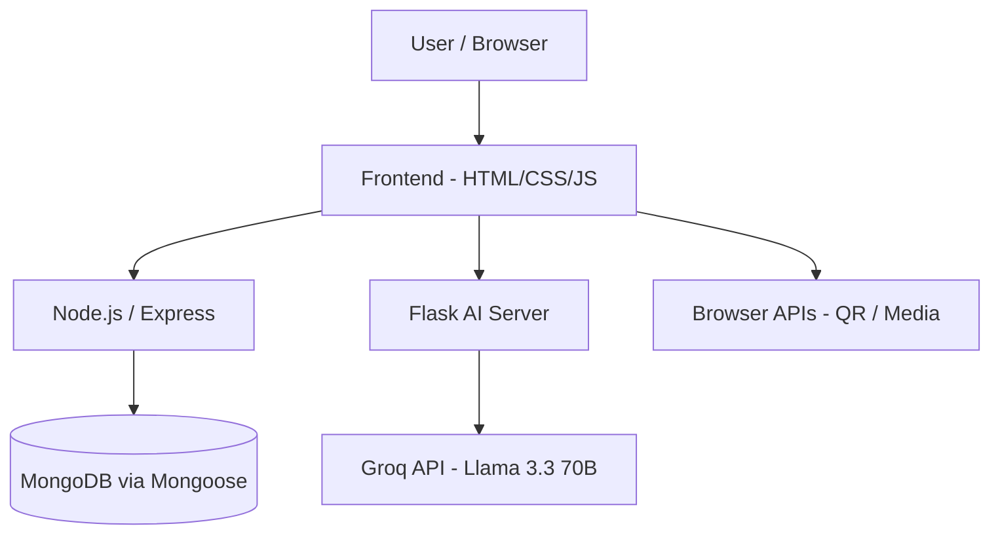

# 🛡️ CyberShield Hub

### AI-Powered Cybersecurity Toolkit

CyberShield Hub is a web-based cybersecurity platform that helps users identify and understand common online threats through multiple security analysis tools and an integrated AI Cyber Assistant.

The platform combines **frontend web technologies, Node.js/Express, Python/Flask, MongoDB, heuristic security analysis, QR analysis, email analysis, media analysis, and Groq-powered AI** into a single cybersecurity toolkit.

---

## 🔗 Links

| | |
|---|---|
| 🖥️ Live Site | https://satyamtiwari23.github.io/CyberSheild_Hub/index.html |
| 💻 GitHub Repo | [Satyamtiwari23/CyberShield-Hub](https://github.com/Satyamtiwari23) |
| 💼 LinkedIn | [Satyam Tiwari](https://www.linkedin.com/in/satyam-tiwari-8s5a4t3y8a7m4104/) |
| ✉️ Email | sttiwari9211@gmail.com |

---

## 📌 Why CyberShield Hub

Everyday cyber threats arrive through several different channels at once — a suspicious link, a phishing email, a malicious QR code, or manipulated media — and most people have no single place to check any of them. CyberShield Hub consolidates multiple analysis tools into one platform and pairs each result with an AI Assistant that explains *why* something looks risky, instead of leaving users with a raw score and no context.



---

## 🚀 Features

### 🔗 1. Phishing Website Detector
Analyzes suspicious URLs using heuristic indicators to flag potentially malicious or phishing websites.
- URL risk scoring and risk-level classification
- IP-address-based URL detection, HTTPS verification, suspicious URL pattern analysis
- Detailed reasons for detected risks, AI-powered explanation, and a report-suspicious-website option

> The URL scanner is heuristic-based and should not be treated as a guaranteed malware/phishing verdict.

### 📱 2. Malicious QR Code Analyzer
Analyzes QR codes and identifies the type of content encoded inside them — UPI/payment, website URL, email, phone, WhatsApp links/groups, Wi-Fi config, location, or plain text. Payment QR codes are recognized separately, and payment-app suggestions (PhonePe, Google Pay, Paytm) only appear after the user chooses to continue past the initial scan — preventing premature payment prompts.

### 📧 3. Phishing Email Analyzer
Users paste email content for risk scoring, threat verdict, suspicious pattern detection, and extracted-URL analysis. Rather than auto-opening links, extracted URLs are surfaced for individual inspection first:



### 🎭 4. Deepfake Media Detector
Accepts image, video, or media-URL input and returns a risk score, confidence level, detection reasons, and verdict. Includes experimentation with browser-based face analysis via **face-api.js**, with room to extend into frame-by-frame, temporal-consistency, and compression-artifact analysis.

> The current frontend/demo analysis should not be represented as a production-grade deepfake detection model unless a trained deepfake model is integrated.

### 🤖 5. CyberShield AI Assistant
An AI-powered assistant (Groq API + Llama 3.3 70B Versatile, served via Python/Flask) that explains cybersecurity results and answers educational questions — phishing results, QR analysis, email threats, suspicious URLs, and general security/programming topics.

---

## 🧠 AI Analysis Workflow



The same flow applies across the phishing URL, QR, and phishing email modules.

### 🎯 Context-Aware AI
The frontend sends a page context alongside each prompt so the AI Assistant scopes its response to the active module instead of behaving like an unrestricted general-purpose chatbot:

```javascript
{
    topic: "...",
    page: "phishing"
}
```

| Page value | Scope |
|---|---|
| `assistant` | General educational assistance |
| `phishing` | Phishing URL analysis only |
| `qr` | QR / security analysis only |
| `email` | Email threat analysis only |
| `deepfake` | Media / deepfake analysis only |

Responses are formatted with headings, bullet points, tables, and code blocks where useful, and security-analysis responses follow a concise structure (verdict, risk level, key findings, possible risks, recommendation).

---

## 🏗️ System Architecture



---

## 💻 Technology Stack

**Frontend** — HTML5, CSS3, JavaScript ES6+, DOM manipulation, Fetch API, LocalStorage, responsive design

**Backend** — Node.js, Express.js (REST API + routing), Python, Flask, Flask-CORS

**Database** — MongoDB, Mongoose (ODM)

**AI** — Groq API, Llama 3.3 70B Versatile, prompt engineering, context-aware prompting, structured AI responses

**QR / Media** — html5-qrcode, face-api.js (deepfake-detection experimentation)

**Tools** — VS Code, Git, GitHub, npm, Python venv, MongoDB Compass/Atlas, Postman, Chrome DevTools

| Category | Technologies |
|---|---|
| Frontend | HTML5, CSS3, JavaScript |
| Backend | Node.js, Express.js |
| AI Backend | Python, Flask |
| Database | MongoDB, Mongoose |
| AI | Groq API, Llama 3.3 70B |
| QR | QR scanning / payload analysis |
| Deepfake | face-api.js / browser-based analysis |
| APIs | REST API, Fetch API |
| Development | VS Code, Git, GitHub |

---

## 📁 Project Structure

```text
CyberShield_Hub/
├── AI-chatbot/
│   ├── app.py
│   ├── .env
│   ├── requirements.txt
│   ├── templates/
│   │   └── index.html
│   └── static/
│
├── application/
│   ├── index.html
│   ├── login.html
│   ├── phishing-link.html
│   ├── phishing-email.html
│   ├── qr-scanner.html
│   ├── deepfake-detector.html
│   ├── scam-message.html
│   ├── chrome-extension.html
│   ├── script.js
│   ├── server.js
│   └── package.json
└── .vscode/
```

---

## 🔌 API Endpoints

### Flask AI Server

**`GET /`** — Loads the AI assistant interface.

**`POST /generate`** — Receives an AI prompt and returns an AI-generated response.

Request:
```json
{ "topic": "Explain phishing attacks", "page": "assistant" }
```

Response:
```json
{ "answer": "..." }
```

---

## 🔐 Environment Variables

Create a `.env` inside the AI chatbot backend:

```env
GROQ_API_KEY=your_groq_api_key
```

`.gitignore` should include:
```gitignore
.env
venv/
__pycache__/
node_modules/
*.log
.DS_Store
```

The Groq client reads the key via `os.getenv("GROQ_API_KEY")` — never hardcoded in source.

---

## ⚙️ Installation Guide

```bash
# 1. Clone the repository
git clone YOUR_REPOSITORY_URL
cd CyberShield_Hub
```

**Node.js backend**
```bash
cd application
npm install
node server.js
# runs on http://localhost:5001
```

**Python AI backend** (separate terminal)
```bash
cd CyberShield_Hub/AI-chatbot
python3 -m venv venv
source venv/bin/activate        # macOS/Linux
python3 -m pip install -r requirements.txt
python3 app.py
# runs on http://127.0.0.1:5000
```

**Frontend**
Serve `application/` with a local dev server (e.g. VS Code Live Server) at `http://127.0.0.1:5500`. The frontend calls the Node backend (`:5001`) and the Flask AI backend (`:5000`) directly.

---

## 🧪 Testing

**Phishing URL** — safe (`https://www.google.com`) vs. suspicious (`http://192.168.1.10/login`) — check risk score, reasons, and AI explanation.

**QR codes** — test payment (`upi://...`), website, phone (`tel:`), email (`mailto:`), SMS, Wi-Fi (`WIFI:T:WPA;...`), and plain-text payloads to confirm each is classified by its actual type.

**Phishing email** — paste an urgency-themed email with an embedded suspicious link and verify risk score, verdict, extracted URLs, and AI explanation.

**Deepfake** — test normal images/video, face images, and AI-generated media; verify upload, preview, risk score, confidence, and detection reasons render correctly. Advanced deepfake testing requires a trained/pretrained detection model.

---

## 🔒 Security Considerations

- API keys stay server-side, never exposed in frontend JavaScript
- Secrets stored in `.env`, which is git-ignored
- User input is validated; URLs and user-provided content are sanitized
- Suspicious URLs are never auto-opened — warnings are shown first
- HTTPS and proper authentication/authorization are expected in production

---

## ⚠️ Limitations

- **URL detection** is heuristic-based and cannot guarantee a site is malicious or safe
- **QR detection** identifies the encoded payload and flags suspicious characteristics but doesn't guarantee destination safety
- **Email detection** relies on implemented rules/logic and isn't a replacement for professional email security systems
- **Deepfake detection** currently uses frontend/artifact-based analysis — true detection requires trained ML/DL models and large datasets
- **AI explanations** may occasionally be inaccurate; security decisions should be independently verified

---

## 🎯 Future Improvements

**Security** — VirusTotal / Google Safe Browsing integration, URL reputation databases, domain age & WHOIS lookup, SSL/DNS analysis, IP reputation, malware sandboxing

**QR** — advanced payload validation, UPI fraud indicators, malicious-redirect detection, QR image manipulation detection

**Email** — SPF/DKIM/DMARC analysis, header analysis, sender reputation, attachment analysis, social-engineering detection

**Deepfake** — TensorFlow.js, facial landmark & frame-by-frame analysis, temporal-inconsistency detection, CNN/transformer-based classification models

**AI** — conversation history, authentication-aware AI, threat-specific agents, AI-generated security reports, multi-model support, streaming responses

---

## 📊 Project Highlights

Full-stack web development · REST API design · Node.js/Express.js · Python/Flask · MongoDB · AI API integration & prompt engineering · Cybersecurity analysis (URL, QR, email, media) · Responsive UI design

---

## 📌 Project Status

🟢 Frontend interface · Phishing URL analysis · QR analysis · Phishing email analysis · AI Assistant · Groq integration · Flask AI backend · Node.js/Express backend · MongoDB integration · Authentication UI

🟡 Advanced deepfake detection · Production-grade threat intelligence

---

## 👨‍💻 Author

**Satyam Tiwari**
B.Tech Information Technology Student — Aspiring Full-Stack & AI Developer

Areas of interest: Full-Stack Development · Artificial Intelligence · Cybersecurity · Machine Learning

---

## ⭐ Disclaimer

CyberShield Hub is an educational cybersecurity project. Detection results are based on implemented heuristics, analysis logic, external APIs, and AI-generated explanations — no result should be considered a guaranteed security verdict. Always verify suspicious URLs, emails, QR codes, and files using trusted security tools before taking action.
